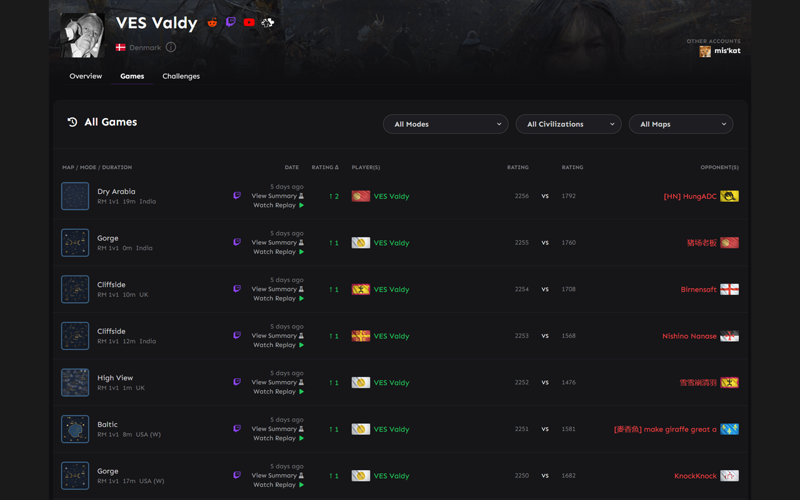

# AoE4 Replay Launcher

Watch any AoE4 ranked game replay directly from [aoe4world.com](https://aoe4world.com) with one click.



## Features

- **One-click replay launching** from any game on aoe4world.com
- **Save replays** — star games to keep them locally for offline viewing
- **Patch-aware** — warns when a replay is from a previous patch, hides replays that are too old
- **Smart caching** — checks replay availability without spamming the API
- **Works with Chrome and Edge**

## Setup

### 1. Install the Chrome/Edge extension

**From the Chrome Web Store:** [AoE4 Replay Launcher](https://chromewebstore.google.com/detail/ckkbdeejodfnpehhllhmhhannpgojfec)

Or load manually:1. Download the latest `chrome-extension-store.zip` from [Releases](https://github.com/spartain-aoe/aoe4world-replay-extension/releases/latest)
2. Extract it
3. Open `chrome://extensions/` (or `edge://extensions/`)
4. Enable **Developer mode** (top right)
5. Click **Load unpacked** → select the extracted folder
6. Note the **extension ID** shown on the card

### 2. Install the native host

1. Download `aoe4-replay-launcher.zip` from [Releases](https://github.com/spartain-aoe/aoe4world-replay-extension/releases/latest)
2. Extract it anywhere
3. Run `install.bat` — it will ask for your extension ID from step 1
4. That's it! Files are installed to `%LOCALAPPDATA%\AoE4ReplayLauncher`

### 3. Browse & watch

Go to any player's game history on [aoe4world.com](https://aoe4world.com):

- **Watch Replay ▶** — appears next to games with available replays. Click to download and launch.
- **⚠ Warning triangle** — replay is from the previous patch. You may need to switch Steam to the older branch to watch it.
- **★ Star** — on game detail pages, click to save the replay locally. Saved replays are available from the extension popup (click the extension icon).

## Uninstall

1. Run `uninstall.bat` (or `install.bat uninstall`)
2. Remove the extension from `chrome://extensions/`

## Requirements

- Windows
- Age of Empires IV installed via Steam
- PowerShell 5.1+
- Chrome or Edge

## How it works under the hood

```
aoe4world.com game page
  → Extension checks WorldsEdge API for replay availability (cached 24h)
  → Compares game patch against current patch
  → Shows "Watch Replay ▶" button (current patch), with ⚠ (prev patch), or hidden (2+ old)
  → Click sends native message to local host
  → Host downloads replay via signed Azure Blob URL
  → Decompresses into AoE4 playback folder
  → Launches AoE4 via Steam into the replay
```

Saved replays (★) are stored locally in the browser and launch without any API calls.

## API

Uses the [WorldsEdge community API](https://aoe-api.worldsedgelink.com/community/leaderboard/getReplayFiles) for replay file access and the [aoe4world stats API](https://aoe4world.com/api/v0/stats/rm_solo/civilizations) for patch version tracking.

## Privacy

No user data is collected. See [PRIVACY.md](PRIVACY.md).

## License

[MIT](LICENSE)
